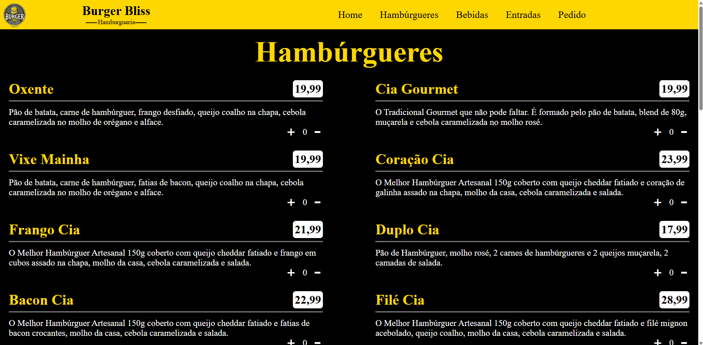
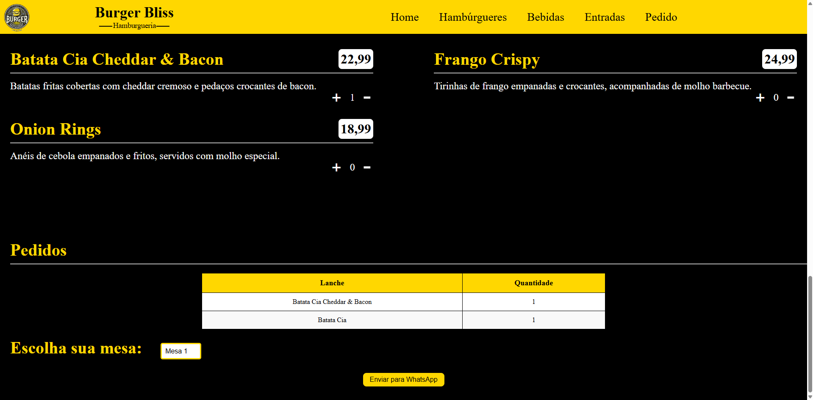

# Burger Bliss 🍔

Bem-vindo ao **Burger Bliss**, um projeto de site desenvolvido para trazer a melhor experiência de uma hamburgueria diretamente para a tela dos usuários! Este é um site simples, moderno e responsivo, criado com **HTML, CSS e JavaScript**, pensado para apresentar **cardápios, promoções e informações de contato** de forma atraente e funcional.

---

## 📋 Sobre o Projeto

O **Burger Bliss** é um site fictício de uma hamburgueria que combina design intuitivo com funcionalidades básicas para atender aos amantes de hambúrgueres. O objetivo foi criar uma interface **limpa e amigável**, ideal para **pequenos negócios** que desejam marcar presença online.

### 🔥 Funcionalidades
- 🍔 **Cardápio Interativo**: Exibe os hambúrgueres e combos disponíveis.
- 📱 **Design Responsivo**: Adapta-se a diferentes tamanhos de tela (desktop, tablet e mobile).
- 🎨 **Estilo Moderno**: Uso de animações sutis e uma paleta de cores apetitosas.
- 🧭 **Fácil Navegação**: Menu simples e intuitivo para o usuário.

---

## 🚀 Como Executar o Projeto

### 🔧 Pré-requisitos
- Um **navegador web** (Chrome, Firefox, Edge, etc.).
- Um **editor de código** (opcional, como VS Code) se quiser personalizar o projeto.

### 📂 Passos
1. **Clone o Repositório**:
   ```bash
   git clone https://github.com/Lucas-Nascimentto/Burger-Bliss.git
   ```
2. **Acesse a Pasta do Projeto**:
   ```bash
   cd Burger-Bliss
   ```
3. **Abra o Arquivo Principal**:
   - Localize o arquivo **index.html** e abra-o em um navegador.
   - Não é necessário servidor local, pois o projeto é puramente frontend.

---

## 🛠️ Tecnologias Utilizadas

- **HTML5**: Estruturação do conteúdo.
- **CSS3**: Estilização e responsividade.
- **JavaScript**: Interatividade e dinamismo.

---

## 📸 Capturas de Tela

Abaixo estão algumas capturas de tela do projeto **Burger Bliss**:

<div align="center">
    <h3>🏠 Página Inicial</h3>
    
</div>

<div align="center">
   <h3>📦 Tela de Pedidos</h3>
    
</div>

---

## 🌟 Contribuições

Contribuições são bem-vindas! Sinta-se à vontade para abrir uma **issue** ou enviar um **pull request**. 

### 📌 Para contribuir:
1. **Faça um fork do projeto**.
2. **Crie uma branch** para sua feature:
   ```bash
   git checkout -b feature/nova-ideia
   ```
3. **Commit suas alterações**:
   ```bash
   git commit -m 'Adiciona nova ideia'
   ```
4. **Push para o repositório remoto**:
   ```bash
   git push origin feature/nova-ideia
   ```
5. **Abra um pull request**.

---

## 📧 Contato

Desenvolvido por **Lucas Nascimento**.

Para dúvidas ou sugestões, entre em contato:
- 📩 **Email**: [lucasna.dev@gmail.com](mailto:lucasna.dev@gmail.com)

---
